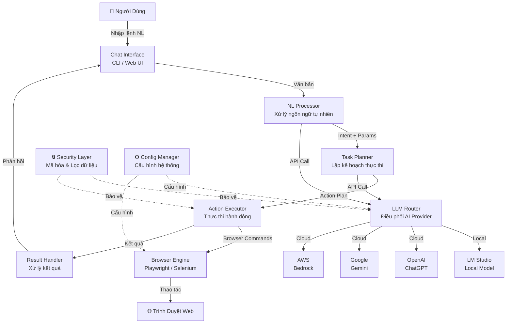
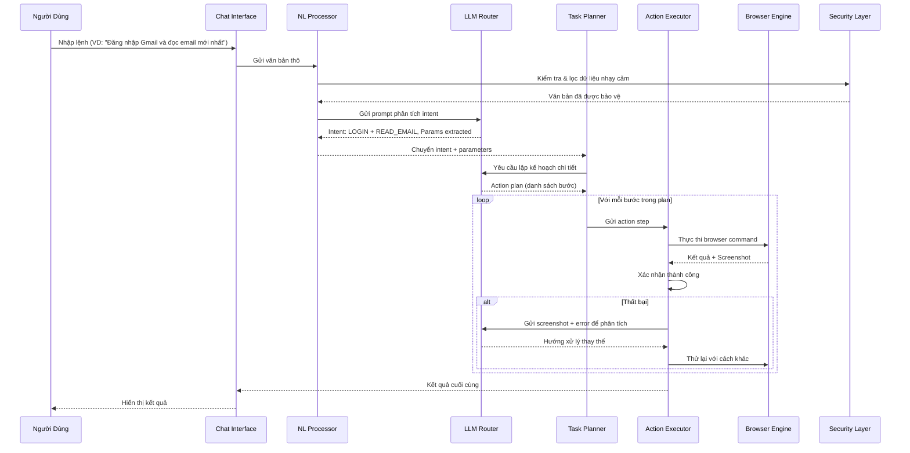
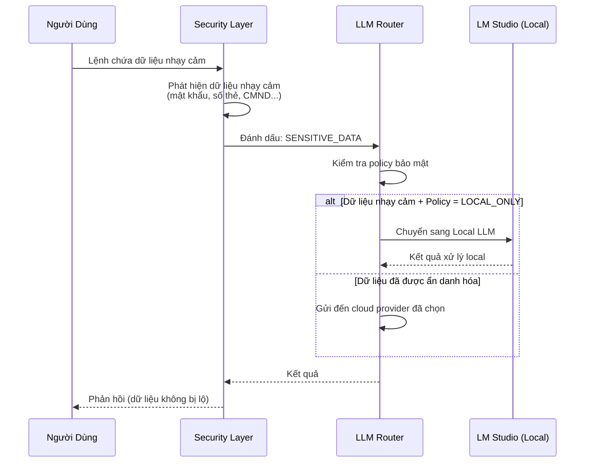

# Tài Liệu Thiết Kế: AI Browser Automation

## Tổng Quan

Công cụ AI Browser Automation là một ứng dụng chạy hoàn toàn trên máy tính cá nhân (local), cho phép người dùng điều khiển trình duyệt web thông qua ngôn ngữ tự nhiên. Người dùng chỉ cần nhập lệnh bằng tiếng Việt hoặc tiếng Anh, hệ thống AI sẽ phân tích, lập kế hoạch và tự động thực thi các thao tác trên trình duyệt như click, nhập liệu, điều hướng, trích xuất dữ liệu.

Hệ thống được thiết kế với ưu tiên hàng đầu về bảo mật dữ liệu — toàn bộ quá trình xử lý diễn ra local, không gửi dữ liệu nhạy cảm ra bên ngoài. Hệ thống hỗ trợ tích hợp linh hoạt với nhiều LLM provider khác nhau (OpenAI ChatGPT, Google Gemini, AWS Bedrock, LM Studio local) để người dùng có thể lựa chọn giữa hiệu năng cloud và bảo mật tuyệt đối với model local.

Kiến trúc module hóa cho phép mở rộng dễ dàng, thay thế LLM provider hoặc browser engine mà không ảnh hưởng đến logic nghiệp vụ chính. Hệ thống sử dụng Playwright làm browser engine chính (với fallback sang Selenium) để đảm bảo tốc độ và độ chính xác 100% trong các thao tác tự động.

## Kiến Trúc Hệ Thống



## Luồng Xử Lý Chính

### Luồng 1: Thực Thi Lệnh Tự Động



### Luồng 2: Chế Độ Bảo Mật Cao (Local LLM)



## Thành Phần và Giao Diện

### Thành Phần 1: LLM Router

**Mục đích**: Điều phối và quản lý kết nối đến các LLM provider khác nhau, tự động chuyển đổi giữa local và cloud dựa trên chính sách bảo mật.

```python
from abc import ABC, abstractmethod
from dataclasses import dataclass
from enum import Enum
from typing import Optional

class LLMProvider(Enum):
    OPENAI = "openai"
    GEMINI = "gemini"
    BEDROCK = "bedrock"
    LM_STUDIO = "lm_studio"

@dataclass
class LLMRequest:
    prompt: str
    context: Optional[str] = None
    max_tokens: int = 2048
    temperature: float = 0.1
    is_sensitive: bool = False

@dataclass
class LLMResponse:
    content: str
    provider_used: LLMProvider
    tokens_used: int
    latency_ms: float

class BaseLLMProvider(ABC):
    @abstractmethod
    async def complete(self, request: LLMRequest) -> LLMResponse:
        """Gửi request đến LLM và nhận response."""
        ...

    @abstractmethod
    async def health_check(self) -> bool:
        """Kiểm tra provider có sẵn sàng không."""
        ...

class LLMRouter:
    def __init__(self, config: "AppConfig"):
        self.providers: dict[LLMProvider, BaseLLMProvider] = {}
        self.default_provider: LLMProvider = config.default_llm
        self.local_provider: LLMProvider = LLMProvider.LM_STUDIO

    async def route(self, request: LLMRequest) -> LLMResponse:
        """Điều phối request đến provider phù hợp."""
        ...

    def register_provider(self, provider_type: LLMProvider, provider: BaseLLMProvider) -> None:
        """Đăng ký một LLM provider mới."""
        ...
```

**Trách nhiệm**:
- Quản lý kết nối đến nhiều LLM provider
- Tự động chuyển sang local LLM khi dữ liệu nhạy cảm
- Fallback sang provider khác khi provider chính lỗi
- Theo dõi latency và token usage

### Thành Phần 2: NL Processor

**Mục đích**: Phân tích ngôn ngữ tự nhiên từ người dùng, trích xuất intent và parameters để chuyển cho Task Planner.

```python
from dataclasses import dataclass, field

class IntentType(Enum):
    NAVIGATE = "navigate"
    CLICK = "click"
    TYPE_TEXT = "type_text"
    EXTRACT_DATA = "extract_data"
    LOGIN = "login"
    SCROLL = "scroll"
    WAIT = "wait"
    SCREENSHOT = "screenshot"
    COMPOSITE = "composite"  # Nhiều intent kết hợp

@dataclass
class ParsedIntent:
    intent_type: IntentType
    target_description: str  # Mô tả phần tử mục tiêu bằng NL
    parameters: dict = field(default_factory=dict)
    confidence: float = 0.0
    sub_intents: list["ParsedIntent"] = field(default_factory=list)

class NLProcessor:
    def __init__(self, llm_router: LLMRouter, security: "SecurityLayer"):
        self.llm_router = llm_router
        self.security = security

    async def parse(self, user_input: str) -> list[ParsedIntent]:
        """Phân tích input người dùng thành danh sách intent."""
        ...

    async def clarify(self, user_input: str, ambiguities: list[str]) -> str:
        """Tạo câu hỏi làm rõ khi input mơ hồ."""
        ...
```

**Trách nhiệm**:
- Phân tích câu lệnh tiếng Việt và tiếng Anh
- Trích xuất intent (hành động) và parameters (đối tượng, giá trị)
- Xử lý câu lệnh phức hợp (nhiều bước trong một câu)
- Phát hiện và yêu cầu làm rõ khi câu lệnh mơ hồ

### Thành Phần 3: Task Planner

**Mục đích**: Chuyển đổi intent thành kế hoạch thực thi chi tiết gồm các bước cụ thể trên trình duyệt.

```python
@dataclass
class ActionStep:
    action_type: str  # "click", "type", "navigate", "wait", "extract"
    selector_strategy: str  # "css", "xpath", "text", "ai_vision"
    selector_value: str
    input_value: Optional[str] = None
    wait_condition: Optional[str] = None
    timeout_ms: int = 10000
    retry_count: int = 3

@dataclass
class ExecutionPlan:
    steps: list[ActionStep]
    description: str
    estimated_duration_ms: int
    requires_auth: bool = False
    sensitive_data_involved: bool = False

class TaskPlanner:
    def __init__(self, llm_router: LLMRouter):
        self.llm_router = llm_router

    async def plan(self, intents: list[ParsedIntent], page_context: "PageContext") -> ExecutionPlan:
        """Tạo kế hoạch thực thi từ danh sách intent và ngữ cảnh trang hiện tại."""
        ...

    async def replan(self, failed_step: ActionStep, error: str, screenshot: bytes) -> list[ActionStep]:
        """Lập kế hoạch thay thế khi một bước thất bại."""
        ...
```

**Trách nhiệm**:
- Chuyển intent thành chuỗi action steps cụ thể
- Xác định selector strategy phù hợp cho từng phần tử
- Lập kế hoạch thay thế khi bước thực thi thất bại
- Ước tính thời gian thực thi

### Thành Phần 4: Action Executor

**Mục đích**: Thực thi các action steps trên trình duyệt thông qua Browser Engine, xử lý lỗi và retry.

```python
@dataclass
class ActionResult:
    success: bool
    step: ActionStep
    extracted_data: Optional[str] = None
    screenshot: Optional[bytes] = None
    error_message: Optional[str] = None
    duration_ms: float = 0.0

class ActionExecutor:
    def __init__(self, browser_engine: "BrowserEngine", llm_router: LLMRouter):
        self.browser = browser_engine
        self.llm_router = llm_router

    async def execute_plan(self, plan: ExecutionPlan) -> list[ActionResult]:
        """Thực thi toàn bộ kế hoạch, trả về kết quả từng bước."""
        ...

    async def execute_step(self, step: ActionStep) -> ActionResult:
        """Thực thi một bước đơn lẻ."""
        ...

    async def smart_retry(self, step: ActionStep, error: str) -> ActionResult:
        """Retry thông minh: dùng AI phân tích lỗi và thử cách khác."""
        ...
```

**Trách nhiệm**:
- Thực thi từng bước trong execution plan
- Chụp screenshot sau mỗi bước để xác nhận
- Retry thông minh với AI khi gặp lỗi
- Báo cáo kết quả chi tiết

### Thành Phần 5: Browser Engine

**Mục đích**: Abstraction layer cho Playwright/Selenium, cung cấp API thống nhất để thao tác trình duyệt.

```python
class BrowserEngine(ABC):
    @abstractmethod
    async def launch(self, headless: bool = False) -> None:
        """Khởi động trình duyệt."""
        ...

    @abstractmethod
    async def navigate(self, url: str) -> None:
        """Điều hướng đến URL."""
        ...

    @abstractmethod
    async def click(self, selector: str, strategy: str = "css") -> None:
        """Click vào phần tử."""
        ...

    @abstractmethod
    async def type_text(self, selector: str, text: str, strategy: str = "css") -> None:
        """Nhập văn bản vào phần tử."""
        ...

    @abstractmethod
    async def extract_text(self, selector: str, strategy: str = "css") -> str:
        """Trích xuất văn bản từ phần tử."""
        ...

    @abstractmethod
    async def screenshot(self) -> bytes:
        """Chụp ảnh màn hình trang hiện tại."""
        ...

    @abstractmethod
    async def get_page_context(self) -> "PageContext":
        """Lấy ngữ cảnh trang hiện tại (DOM summary, URL, title)."""
        ...

    @abstractmethod
    async def close(self) -> None:
        """Đóng trình duyệt."""
        ...

@dataclass
class PageContext:
    url: str
    title: str
    dom_summary: str  # Simplified DOM tree cho LLM
    visible_elements: list[dict]  # Danh sách phần tử hiển thị
    screenshot: Optional[bytes] = None
```

**Trách nhiệm**:
- Cung cấp API thống nhất cho Playwright và Selenium
- Quản lý vòng đời trình duyệt (launch, close)
- Trích xuất ngữ cảnh trang cho AI phân tích
- Xử lý wait conditions và timeouts

### Thành Phần 6: Security Layer

**Mục đích**: Bảo vệ dữ liệu nhạy cảm, đảm bảo không có thông tin quan trọng bị gửi ra ngoài khi không cần thiết.

```python
@dataclass
class SecurityPolicy:
    sensitive_patterns: list[str]  # Regex patterns cho dữ liệu nhạy cảm
    force_local_on_sensitive: bool = True
    encrypt_local_storage: bool = True
    mask_in_logs: bool = True

class SecurityLayer:
    def __init__(self, policy: SecurityPolicy):
        self.policy = policy

    def detect_sensitive_data(self, text: str) -> list[str]:
        """Phát hiện dữ liệu nhạy cảm trong văn bản."""
        ...

    def sanitize_for_cloud(self, text: str) -> tuple[str, dict]:
        """Ẩn danh hóa dữ liệu trước khi gửi cloud. Trả về (text đã ẩn, mapping để khôi phục)."""
        ...

    def restore_sensitive_data(self, text: str, mapping: dict) -> str:
        """Khôi phục dữ liệu nhạy cảm từ mapping."""
        ...

    def should_use_local_llm(self, text: str) -> bool:
        """Quyết định có nên dùng local LLM không dựa trên nội dung."""
        ...
```

**Trách nhiệm**:
- Phát hiện dữ liệu nhạy cảm (mật khẩu, số thẻ, CMND, email cá nhân)
- Ẩn danh hóa dữ liệu trước khi gửi đến cloud LLM
- Quyết định routing local/cloud dựa trên chính sách bảo mật
- Mã hóa dữ liệu lưu trữ local

## Mô Hình Dữ Liệu

### AppConfig

```python
@dataclass
class AppConfig:
    # LLM Configuration
    default_llm: LLMProvider = LLMProvider.LM_STUDIO
    openai_api_key: Optional[str] = None
    gemini_api_key: Optional[str] = None
    bedrock_region: Optional[str] = None
    lm_studio_url: str = "http://localhost:1234/v1"
    
    # Browser Configuration
    browser_type: str = "chromium"  # chromium, firefox, webkit
    browser_engine: str = "playwright"  # playwright, selenium
    headless: bool = False
    
    # Security Configuration
    security_policy: SecurityPolicy = field(default_factory=SecurityPolicy)
    
    # Performance
    action_timeout_ms: int = 10000
    max_retries: int = 3
```

**Quy tắc validation**:
- `openai_api_key` phải bắt đầu bằng "sk-" nếu được cung cấp
- `lm_studio_url` phải là URL hợp lệ
- `action_timeout_ms` phải > 0 và <= 60000
- `max_retries` phải >= 0 và <= 10

### ConversationHistory

```python
@dataclass
class ConversationTurn:
    role: str  # "user" hoặc "assistant"
    content: str
    timestamp: float
    actions_taken: list[ActionResult] = field(default_factory=list)

@dataclass
class ConversationHistory:
    turns: list[ConversationTurn] = field(default_factory=list)
    max_context_turns: int = 20

    def add_turn(self, turn: ConversationTurn) -> None:
        """Thêm lượt hội thoại, tự động cắt bớt nếu vượt quá giới hạn."""
        ...

    def get_context_window(self) -> list[ConversationTurn]:
        """Lấy các lượt hội thoại gần nhất trong context window."""
        ...
```

**Quy tắc validation**:
- `role` chỉ chấp nhận "user" hoặc "assistant"
- `content` không được rỗng
- `max_context_turns` phải >= 1


## Thuật Toán Chi Tiết (Algorithmic Pseudocode)

### Thuật Toán 1: Xử Lý Lệnh Người Dùng (Main Pipeline)

```python
async def process_user_command(user_input: str, history: ConversationHistory,
                                config: AppConfig) -> str:
    """
    Pipeline chính: từ lệnh ngôn ngữ tự nhiên đến thực thi trên trình duyệt.
    
    Preconditions:
        - user_input là chuỗi không rỗng
        - Browser engine đã được khởi động
        - Ít nhất một LLM provider đã được đăng ký và sẵn sàng
    
    Postconditions:
        - Trả về chuỗi mô tả kết quả thực thi
        - Nếu thành công: tất cả action steps đã được thực thi trên trình duyệt
        - Nếu thất bại: trả về thông báo lỗi chi tiết, trình duyệt ở trạng thái ổn định
        - ConversationHistory được cập nhật với lượt hội thoại mới
    """
    # Bước 1: Kiểm tra và xử lý bảo mật
    security = SecurityLayer(config.security_policy)
    is_sensitive = security.should_use_local_llm(user_input)
    
    # Bước 2: Phân tích ngôn ngữ tự nhiên
    nl_processor = NLProcessor(llm_router, security)
    intents = await nl_processor.parse(user_input)
    
    # Bước 3: Kiểm tra độ tin cậy, yêu cầu làm rõ nếu cần
    if any(intent.confidence < 0.7 for intent in intents):
        low_confidence = [i for i in intents if i.confidence < 0.7]
        clarification = await nl_processor.clarify(user_input, 
            [i.target_description for i in low_confidence])
        return f"Xin hãy làm rõ: {clarification}"
    
    # Bước 4: Lấy ngữ cảnh trang hiện tại
    page_context = await browser_engine.get_page_context()
    
    # Bước 5: Lập kế hoạch thực thi
    planner = TaskPlanner(llm_router)
    plan = await planner.plan(intents, page_context)
    
    # Bước 6: Thực thi kế hoạch
    executor = ActionExecutor(browser_engine, llm_router)
    results = await executor.execute_plan(plan)
    
    # Bước 7: Tổng hợp kết quả
    success_count = sum(1 for r in results if r.success)
    total_count = len(results)
    
    # Bước 8: Cập nhật lịch sử hội thoại
    summary = format_results(results)
    history.add_turn(ConversationTurn(
        role="user", content=user_input, timestamp=time.time()
    ))
    history.add_turn(ConversationTurn(
        role="assistant", content=summary, 
        timestamp=time.time(), actions_taken=results
    ))
    
    return summary
```

### Thuật Toán 2: LLM Routing Thông Minh

```python
async def route(self, request: LLMRequest) -> LLMResponse:
    """
    Điều phối request đến LLM provider phù hợp dựa trên chính sách bảo mật
    và tình trạng sẵn sàng của các provider.
    
    Preconditions:
        - Ít nhất một provider đã được đăng ký trong self.providers
        - request.prompt là chuỗi không rỗng
    
    Postconditions:
        - Trả về LLMResponse với content không rỗng
        - Nếu request.is_sensitive = True, provider_used phải là local provider
        - Nếu tất cả provider đều lỗi, raise LLMUnavailableError
    
    Loop Invariants:
        - Trong vòng lặp fallback: mỗi provider chỉ được thử tối đa 1 lần
        - Danh sách tried_providers tăng đơn điệu
    """
    # Xác định provider ưu tiên
    if request.is_sensitive:
        target_provider = self.local_provider
    else:
        target_provider = self.default_provider
    
    # Thử provider ưu tiên trước
    tried_providers: set[LLMProvider] = set()
    
    # Fallback chain: target -> default -> còn lại
    fallback_order = [target_provider, self.default_provider]
    fallback_order.extend(p for p in self.providers if p not in fallback_order)
    
    for provider_type in fallback_order:
        if provider_type in tried_providers:
            continue
        if provider_type not in self.providers:
            continue
            
        # Không gửi dữ liệu nhạy cảm đến cloud
        if request.is_sensitive and provider_type != self.local_provider:
            continue
        
        tried_providers.add(provider_type)
        provider = self.providers[provider_type]
        
        try:
            if await provider.health_check():
                response = await provider.complete(request)
                return response
        except Exception:
            continue  # Thử provider tiếp theo
    
    raise LLMUnavailableError("Không có LLM provider nào sẵn sàng")
```

### Thuật Toán 3: Thực Thi Kế Hoạch Với Smart Retry

```python
async def execute_plan(self, plan: ExecutionPlan) -> list[ActionResult]:
    """
    Thực thi toàn bộ execution plan với cơ chế retry thông minh.
    
    Preconditions:
        - plan.steps không rỗng
        - Browser đã được khởi động và ở trạng thái sẵn sàng
        - Mỗi step có selector_value không rỗng
    
    Postconditions:
        - Trả về danh sách ActionResult có cùng số lượng với plan.steps
        - Mỗi ActionResult.step tương ứng với step trong plan theo thứ tự
        - Nếu tất cả thành công: all(r.success for r in results) = True
        - Nếu có lỗi không khắc phục được: dừng sớm, các step còn lại không thực thi
    
    Loop Invariants:
        - len(results) = số step đã được xử lý (thành công hoặc thất bại cuối cùng)
        - Tất cả results trước index hiện tại đều có success = True
          (trừ khi đang ở bước cuối cùng thất bại)
    """
    results: list[ActionResult] = []
    
    for step in plan.steps:
        result = await self.execute_step(step)
        
        if not result.success:
            # Thử retry thông minh
            for attempt in range(step.retry_count):
                # Chụp screenshot để AI phân tích
                screenshot = await self.browser.screenshot()
                
                # Dùng AI phân tích lỗi và đề xuất cách khác
                retry_result = await self.smart_retry(step, result.error_message)
                
                if retry_result.success:
                    result = retry_result
                    break
            
            if not result.success:
                # Thử replan: yêu cầu AI lập kế hoạch thay thế
                new_steps = await TaskPlanner(self.llm_router).replan(
                    step, result.error_message, screenshot
                )
                if new_steps:
                    for new_step in new_steps:
                        alt_result = await self.execute_step(new_step)
                        if alt_result.success:
                            result = alt_result
                            break
        
        results.append(result)
        
        if not result.success:
            break  # Dừng nếu không thể khắc phục
    
    return results
```

### Thuật Toán 4: Phát Hiện Dữ Liệu Nhạy Cảm

```python
import re

def detect_sensitive_data(self, text: str) -> list[str]:
    """
    Quét văn bản để phát hiện các loại dữ liệu nhạy cảm.
    
    Preconditions:
        - text là chuỗi (có thể rỗng)
        - self.policy.sensitive_patterns đã được khởi tạo
    
    Postconditions:
        - Trả về danh sách các chuỗi nhạy cảm tìm thấy
        - Nếu text rỗng: trả về danh sách rỗng
        - Không thay đổi text gốc
    """
    BUILTIN_PATTERNS = {
        "email": r"[a-zA-Z0-9._%+-]+@[a-zA-Z0-9.-]+\.[a-zA-Z]{2,}",
        "phone_vn": r"(0|\+84)[0-9]{9,10}",
        "credit_card": r"\b\d{4}[\s-]?\d{4}[\s-]?\d{4}[\s-]?\d{4}\b",
        "cmnd_cccd": r"\b\d{9}(\d{3})?\b",  # 9 hoặc 12 số
        "password_field": r"(?i)(password|mật\s*khẩu|pass|pwd)\s*[:=]\s*\S+",
    }
    
    found: list[str] = []
    
    # Kiểm tra builtin patterns
    for pattern_name, pattern in BUILTIN_PATTERNS.items():
        matches = re.findall(pattern, text)
        found.extend(matches)
    
    # Kiểm tra custom patterns từ policy
    for pattern in self.policy.sensitive_patterns:
        matches = re.findall(pattern, text)
        found.extend(matches)
    
    return found

def sanitize_for_cloud(self, text: str) -> tuple[str, dict]:
    """
    Thay thế dữ liệu nhạy cảm bằng placeholder trước khi gửi cloud.
    
    Preconditions:
        - text là chuỗi không rỗng
    
    Postconditions:
        - Trả về (sanitized_text, mapping)
        - sanitized_text không chứa bất kỳ dữ liệu nhạy cảm nào
        - mapping cho phép khôi phục: restore(sanitized_text, mapping) = text gốc
        - len(mapping) = số lượng dữ liệu nhạy cảm được thay thế
    """
    sensitive_items = self.detect_sensitive_data(text)
    mapping: dict[str, str] = {}
    sanitized = text
    
    for i, item in enumerate(sensitive_items):
        placeholder = f"<<REDACTED_{i}>>"
        mapping[placeholder] = item
        sanitized = sanitized.replace(item, placeholder)
    
    return sanitized, mapping
```

### Thuật Toán 5: Trích Xuất Ngữ Cảnh Trang Cho AI

```python
async def get_page_context(self) -> PageContext:
    """
    Trích xuất ngữ cảnh trang web hiện tại dưới dạng tóm tắt cho LLM.
    
    Preconditions:
        - Trình duyệt đã được khởi động
        - Có ít nhất một tab đang mở
    
    Postconditions:
        - Trả về PageContext với url và title không rỗng
        - dom_summary chứa tóm tắt DOM dưới 4000 tokens
        - visible_elements chỉ chứa các phần tử đang hiển thị và tương tác được
    """
    url = await self.page.url
    title = await self.page.title()
    
    # Trích xuất DOM tóm tắt (chỉ các phần tử tương tác được)
    dom_summary = await self.page.evaluate("""
        () => {
            const interactable = document.querySelectorAll(
                'a, button, input, select, textarea, [role="button"], [onclick]'
            );
            return Array.from(interactable).slice(0, 50).map(el => ({
                tag: el.tagName.toLowerCase(),
                text: el.textContent?.trim().substring(0, 100),
                type: el.getAttribute('type'),
                placeholder: el.getAttribute('placeholder'),
                aria_label: el.getAttribute('aria-label'),
                href: el.getAttribute('href'),
                id: el.id,
                name: el.getAttribute('name'),
                visible: el.offsetParent !== null
            })).filter(el => el.visible);
        }
    """)
    
    screenshot = await self.page.screenshot()
    
    return PageContext(
        url=url,
        title=title,
        dom_summary=str(dom_summary),
        visible_elements=dom_summary,
        screenshot=screenshot
    )
```

## Hàm Chính Với Đặc Tả Hình Thức

### Hàm: parse() — Phân Tích Ngôn Ngữ Tự Nhiên

```python
async def parse(self, user_input: str) -> list[ParsedIntent]:
    """Phân tích input người dùng thành danh sách intent có cấu trúc."""
    ...
```

**Preconditions:**
- `user_input` là chuỗi không rỗng, đã được strip whitespace
- `self.llm_router` đã được khởi tạo với ít nhất 1 provider
- `self.security` đã được khởi tạo

**Postconditions:**
- Trả về danh sách `ParsedIntent` không rỗng (ít nhất 1 intent)
- Mỗi intent có `confidence` trong khoảng [0.0, 1.0]
- Mỗi intent có `intent_type` thuộc `IntentType` enum
- Nếu câu lệnh phức hợp: intent đầu tiên có `intent_type = COMPOSITE` và `sub_intents` không rỗng

**Loop Invariants:** N/A

---

### Hàm: execute_step() — Thực Thi Một Bước

```python
async def execute_step(self, step: ActionStep) -> ActionResult:
    """Thực thi một action step đơn lẻ trên trình duyệt."""
    ...
```

**Preconditions:**
- `step.selector_value` không rỗng
- `step.action_type` thuộc tập {"click", "type", "navigate", "wait", "extract", "scroll", "screenshot"}
- `step.timeout_ms` > 0
- Browser đang ở trạng thái sẵn sàng (không đang loading)

**Postconditions:**
- Trả về `ActionResult` với `step` = step đầu vào
- Nếu `success = True`: hành động đã được thực thi thành công trên trình duyệt
- Nếu `success = False`: `error_message` không rỗng, mô tả lỗi cụ thể
- `duration_ms` >= 0 và phản ánh thời gian thực thi thực tế
- Nếu `action_type = "extract"`: `extracted_data` chứa dữ liệu trích xuất

**Loop Invariants:** N/A

---

### Hàm: smart_retry() — Retry Thông Minh Với AI

```python
async def smart_retry(self, step: ActionStep, error: str) -> ActionResult:
    """Phân tích lỗi bằng AI và thử cách tiếp cận khác."""
    ...
```

**Preconditions:**
- `step` là bước đã thất bại trước đó
- `error` là chuỗi mô tả lỗi không rỗng
- Browser vẫn đang hoạt động

**Postconditions:**
- Trả về `ActionResult` mới
- Nếu `success = True`: đã tìm được cách thay thế và thực thi thành công
- Nếu `success = False`: AI không tìm được cách khắc phục
- Selector strategy có thể khác với step gốc (AI đề xuất selector mới)

**Loop Invariants:** N/A

## Ví Dụ Sử Dụng

```python
import asyncio

async def main():
    # Khởi tạo cấu hình
    config = AppConfig(
        default_llm=LLMProvider.LM_STUDIO,  # Mặc định dùng local cho bảo mật
        lm_studio_url="http://localhost:1234/v1",
        openai_api_key="sk-...",  # Tùy chọn: dùng khi cần hiệu năng cao
        browser_engine="playwright",
        headless=False,  # Hiển thị trình duyệt để người dùng theo dõi
    )
    
    # Khởi tạo hệ thống
    app = AIBrowserAutomation(config)
    await app.initialize()
    
    # Ví dụ 1: Lệnh đơn giản
    result = await app.chat("Mở trang google.com và tìm kiếm 'thời tiết Hà Nội'")
    print(result)
    # Output: "Đã mở Google và tìm kiếm 'thời tiết Hà Nội'. Kết quả hiển thị..."
    
    # Ví dụ 2: Lệnh phức hợp
    result = await app.chat("Đăng nhập vào Gmail, đọc email mới nhất và tóm tắt nội dung")
    print(result)
    # Output: "Đã đăng nhập Gmail. Email mới nhất từ [sender]: [tóm tắt nội dung]..."
    
    # Ví dụ 3: Trích xuất dữ liệu
    result = await app.chat("Vào trang shopee.vn, tìm 'laptop' và lấy giá 5 sản phẩm đầu tiên")
    print(result)
    # Output: "Đã tìm 'laptop' trên Shopee. 5 sản phẩm đầu tiên: 1. ... 15tr, 2. ... 18tr..."
    
    # Ví dụ 4: Chế độ bảo mật cao (tự động dùng local LLM)
    result = await app.chat("Đăng nhập ngân hàng với tài khoản [username] mật khẩu [password]")
    print(result)
    # Output: "⚠️ Phát hiện dữ liệu nhạy cảm. Đã chuyển sang xử lý local. Đã đăng nhập thành công."
    
    # Ví dụ 5: Hội thoại liên tục (context-aware)
    await app.chat("Mở trang vnexpress.net")
    result = await app.chat("Đọc tiêu đề 3 bài viết mới nhất")  # Hiểu context: đang ở vnexpress
    print(result)
    
    await app.shutdown()

# Chạy ứng dụng
asyncio.run(main())
```

## Correctness Properties

*A property is a characteristic or behavior that should hold true across all valid executions of a system — essentially, a formal statement about what the system should do. Properties serve as the bridge between human-readable specifications and machine-verifiable correctness guarantees.*

### Property 1: NL Parse Output Invariants

*For any* non-empty, non-whitespace input string, the NL_Processor.parse() function SHALL return a non-empty list of ParsedIntent where every intent has an intent_type belonging to the IntentType enum and a confidence value in the range [0.0, 1.0].

**Validates: Requirement 1.1**

### Property 2: Low Confidence Triggers Clarification

*For any* ParsedIntent with confidence < 0.7, the system SHALL return a clarification request instead of proceeding to execution. Conversely, *for any* set of intents where all have confidence >= 0.7, the system SHALL proceed to planning and execution.

**Validates: Requirement 1.3**

### Property 3: Whitespace Input Rejection

*For any* string composed entirely of whitespace characters (spaces, tabs, newlines, or empty string), the NL_Processor SHALL reject the input and return an error, leaving the system state unchanged.

**Validates: Requirement 1.4**

### Property 4: Execution Plan Result Integrity

*For any* ExecutionPlan where all steps succeed, the Action_Executor SHALL return a list of ActionResult where: (a) len(results) == len(plan.steps), (b) results[i].step corresponds to plan.steps[i] for all i, and (c) every result has duration_ms >= 0.

**Validates: Requirements 3.1, 3.6**

### Property 5: Retry Bounded by retry_count

*For any* ActionStep that fails, the number of smart retry attempts SHALL be at most equal to step.retry_count. The system SHALL not exceed this bound regardless of the failure type.

**Validates: Requirement 3.2**

### Property 6: Failure Stops Subsequent Execution

*For any* ExecutionPlan where step at index N fails irrecoverably (all retries and replans exhausted), no steps at index > N SHALL be executed, and len(results) SHALL equal N + 1.

**Validates: Requirement 3.4**

### Property 7: Sensitive Data Routes to Local LLM

*For any* LLMRequest with is_sensitive = True, the LLM_Router SHALL route the request exclusively to the Local_LLM (LM Studio). No Cloud_LLM provider SHALL receive the request, regardless of provider availability or fallback configuration.

**Validates: Requirements 4.1, 9.4**

### Property 8: Fallback Exhaustion and Provider Uniqueness

*For any* set of registered LLM providers where the default provider is unavailable, the LLM_Router SHALL try each provider at most once. If all providers fail, the router SHALL raise LLMUnavailableError. The set of tried providers SHALL have no duplicates.

**Validates: Requirements 4.2, 4.3, 4.4**

### Property 9: Sensitive Data Detection Completeness

*For any* text containing data matching builtin sensitive patterns (email, Vietnamese phone number, credit card, CMND/CCCD, password field), the Security_Layer.detect_sensitive_data() SHALL return a list containing all matching items.

**Validates: Requirement 5.1**

### Property 10: Sanitization Removes All Sensitive Patterns

*For any* text containing sensitive data, after calling Security_Layer.sanitize_for_cloud(), the sanitized output SHALL not match any builtin or custom sensitive data patterns.

**Validates: Requirement 5.2**

### Property 11: Sanitize/Restore Round-Trip

*For any* text (with or without sensitive data), calling restore_sensitive_data(sanitize_for_cloud(text)) SHALL produce the original text. This is the identity property: restore ∘ sanitize = id.

**Validates: Requirement 5.3**

### Property 12: Custom Sensitive Patterns

*For any* custom regex pattern added to SecurityPolicy.sensitive_patterns, and *for any* text matching that pattern, the Security_Layer SHALL detect the matching data in addition to all builtin pattern matches.

**Validates: Requirement 5.4**

### Property 13: Conversation History Bounded

*For any* ConversationHistory with max_context_turns = N, after adding any number of turns, the number of turns returned by get_context_window() SHALL never exceed N.

**Validates: Requirements 7.1, 7.2**

### Property 14: Conversation Turn Validation

*For any* ConversationTurn, the system SHALL accept it only if role is exactly "user" or "assistant" AND content is a non-empty string. All other combinations SHALL be rejected.

**Validates: Requirements 7.3, 7.4**

### Property 15: Configuration Validation

*For any* AppConfig values: (a) openai_api_key SHALL be accepted only if it starts with "sk-" or is None, (b) lm_studio_url SHALL be a valid URL, (c) action_timeout_ms SHALL be in range (0, 60000], (d) max_retries SHALL be in range [0, 10]. Invalid values SHALL be rejected during validation.

**Validates: Requirements 8.1, 8.2, 8.3, 8.4**

## Xử Lý Lỗi

### Lỗi 1: LLM Provider Không Khả Dụng

**Điều kiện**: Tất cả LLM provider đã đăng ký đều không phản hồi hoặc trả về lỗi.
**Phản hồi**: Thông báo người dùng danh sách provider đã thử và lỗi cụ thể từng provider.
**Khắc phục**: Gợi ý kiểm tra kết nối mạng, API key, hoặc khởi động LM Studio local.

### Lỗi 2: Phần Tử Không Tìm Thấy Trên Trang

**Điều kiện**: Selector không khớp với bất kỳ phần tử nào trên trang hiện tại.
**Phản hồi**: Chụp screenshot, gửi cho AI phân tích và đề xuất selector thay thế.
**Khắc phục**: AI tự động thử các selector strategy khác (CSS → XPath → text content → AI vision).

### Lỗi 3: Trang Web Thay Đổi Layout

**Điều kiện**: Trang web đã cập nhật giao diện, các selector cũ không còn hoạt động.
**Phản hồi**: AI phân tích screenshot mới và tạo selector mới dựa trên ngữ cảnh visual.
**Khắc phục**: Replan toàn bộ bước thất bại với ngữ cảnh trang mới.

### Lỗi 4: Timeout Khi Chờ Trang Tải

**Điều kiện**: Trang web không tải xong trong thời gian `action_timeout_ms`.
**Phản hồi**: Thông báo timeout và URL đang cố truy cập.
**Khắc phục**: Retry với timeout tăng gấp đôi, tối đa 3 lần. Nếu vẫn lỗi, gợi ý kiểm tra kết nối mạng.

## Chiến Lược Kiểm Thử

### Kiểm Thử Đơn Vị (Unit Testing)

- Test NLProcessor.parse() với các câu lệnh tiếng Việt và tiếng Anh
- Test SecurityLayer.detect_sensitive_data() với các pattern nhạy cảm
- Test SecurityLayer.sanitize_for_cloud() và restore_sensitive_data() đảm bảo đối xứng
- Test LLMRouter.route() với các kịch bản: sensitive data, provider failure, fallback
- Test TaskPlanner.plan() với các loại intent khác nhau

### Kiểm Thử Dựa Trên Thuộc Tính (Property-Based Testing)

**Thư viện**: `hypothesis` (Python)

- Property: sanitize → restore luôn trả về text gốc (CP5)
- Property: detect_sensitive_data không bỏ sót pattern đã định nghĩa
- Property: LLM routing luôn ưu tiên local khi is_sensitive = True (CP1)
- Property: execute_plan trả về đúng số lượng results (CP2)

### Kiểm Thử Tích Hợp (Integration Testing)

- Test end-to-end: từ lệnh NL đến thực thi trên trình duyệt thật (headless mode)
- Test fallback chain: tắt provider chính, xác nhận hệ thống chuyển sang provider phụ
- Test bảo mật: xác nhận dữ liệu nhạy cảm không xuất hiện trong log hoặc request cloud

## Cân Nhắc Hiệu Năng

- **DOM Summary**: Giới hạn 50 phần tử tương tác để giữ context window nhỏ cho LLM
- **Screenshot**: Chỉ chụp khi cần (lỗi hoặc AI vision), không chụp mỗi bước
- **LLM Caching**: Cache kết quả phân tích cho các pattern lệnh tương tự
- **Parallel Execution**: Các bước độc lập có thể thực thi song song
- **Connection Pooling**: Tái sử dụng kết nối HTTP đến LLM provider

## Cân Nhắc Bảo Mật

- **Local-First**: Mặc định sử dụng LM Studio local, chỉ dùng cloud khi người dùng chọn
- **Data Sanitization**: Tự động phát hiện và ẩn danh hóa dữ liệu nhạy cảm trước khi gửi cloud
- **No Logging Sensitive Data**: Dữ liệu nhạy cảm bị mask trong tất cả log files
- **Encrypted Storage**: Cấu hình (API keys, credentials) được mã hóa khi lưu local
- **No Telemetry**: Không gửi bất kỳ dữ liệu sử dụng nào ra bên ngoài
- **Sandboxed Browser**: Trình duyệt chạy trong sandbox, cách ly với hệ thống

## Design Patterns & Conventions

### Design Patterns Áp Dụng

| Pattern | Áp Dụng Cho | Mục Đích |
|---------|-------------|----------|
| Strategy | LLM Providers, Browser Engines | Swap implementation không sửa code |
| Chain of Responsibility | LLM Routing, Error Recovery | Fallback chain qua nhiều handler |
| Command | ActionStep, ExecutionPlan | Serialize, queue browser actions |
| Factory | Provider/Engine creation | Tạo instance từ config, tránh if/else |
| Observer | Action events, Logging | Decouple monitoring khỏi logic |
| Facade | AIBrowserAutomation | API đơn giản cho user code |
| Dependency Injection | Tất cả components | Dễ test, dễ swap |

### Cấu Trúc Dự Án

```
ai_browser_automation/
├── core/                    # NLProcessor, TaskPlanner, ActionExecutor
├── llm/                     # BaseLLMProvider, Router, Factory, Providers
├── browser/                 # BrowserEngine, Factory, Playwright, Selenium
├── security/                # SecurityLayer
├── models/                  # Config, Intents, Actions, Conversation
├── exceptions/              # AppError hierarchy
├── interfaces/              # Chat Interface (CLI)
├── app.py                   # Facade
└── main.py                  # Entry point
tests/
├── unit/                    # Mirror source structure
├── integration/             # End-to-end tests
└── properties/              # Property-based tests (hypothesis)
```

### Coding Conventions

- Type hints bắt buộc cho tất cả function signatures
- Google-style docstrings cho public methods
- `@dataclass` cho data objects, `pydantic.BaseModel` cho validated config
- `async/await` cho tất cả I/O operations
- Custom exceptions kế thừa từ `AppError`
- Dependency injection qua constructor
- `__all__` explicit trong mỗi `__init__.py`
- Max line length: 100 characters

Chi tiết đầy đủ xem tại `.kiro/steering/` (design-patterns.md, python-conventions.md, project-structure.md, security-rules.md).

## Phụ Thuộc (Dependencies)

| Thư viện | Phiên bản | Mục đích |
|----------|-----------|----------|
| `playwright` | >= 1.40 | Browser automation engine chính |
| `selenium` | >= 4.15 | Browser engine dự phòng |
| `browser-use` | >= 0.1 | Tích hợp AI với browser |
| `openai` | >= 1.0 | OpenAI ChatGPT client |
| `google-generativeai` | >= 0.3 | Google Gemini client |
| `boto3` | >= 1.34 | AWS Bedrock client |
| `httpx` | >= 0.25 | HTTP client cho LM Studio API |
| `cryptography` | >= 41.0 | Mã hóa dữ liệu local |
| `pydantic` | >= 2.0 | Validation dữ liệu |
| `hypothesis` | >= 6.0 | Property-based testing |
| `pytest` | >= 7.0 | Testing framework |
| `pytest-asyncio` | >= 0.23 | Async test support |
