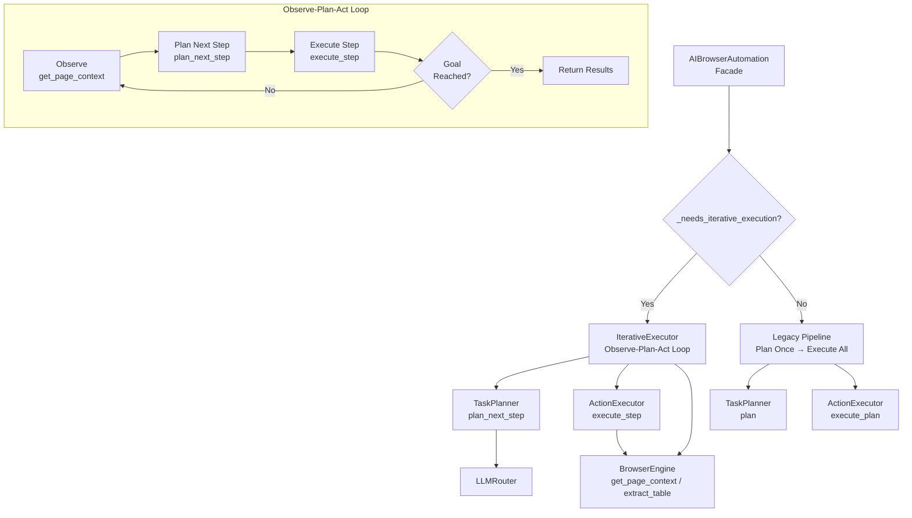
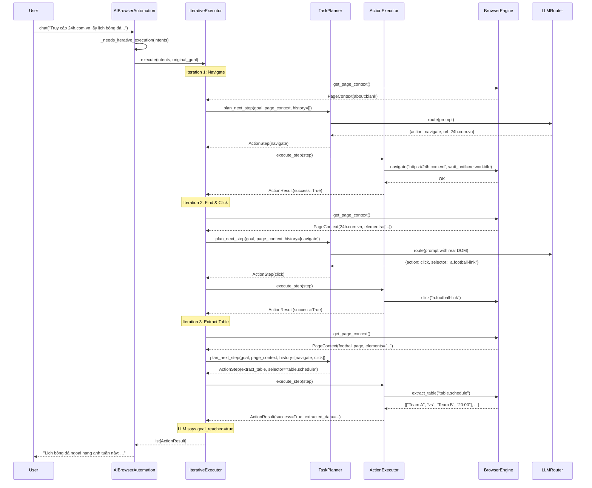
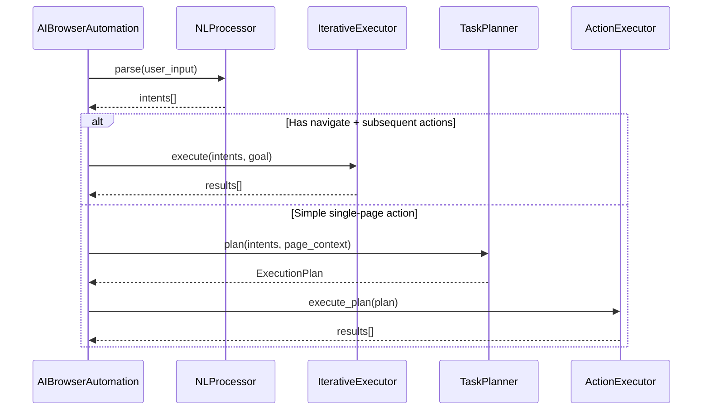

# Design Document: Iterative Execution Pipeline

## Tổng Quan

Hệ thống hiện tại chạy pipeline một lần duy nhất: `parse → plan (dựa trên page context ban đầu) → execute tất cả steps`. Với các prompt đa bước như "Truy cập 24h.com.vn lấy lịch bóng đá ngoại hạng anh tuần này", planner phải đoán tất cả selectors từ `about:blank` — luôn thất bại vì không có DOM context thực tế.

Giải pháp là vòng lặp **Observe-Plan-Act**: sau mỗi action (đặc biệt là `navigate`), hệ thống observe lại page context mới, plan bước tiếp theo dựa trên DOM thực tế, rồi execute. Vòng lặp tiếp tục cho đến khi hoàn thành mục tiêu hoặc đạt giới hạn iterations.

Ngoài ra, cần bổ sung khả năng `extract_table` để trích xuất dữ liệu bảng (lịch bóng đá, bảng xếp hạng...) thay vì chỉ lấy text từ 1 selector, và cải thiện wait strategy cho các trang JS-heavy (dùng `networkidle` thay vì `domcontentloaded`).

## Kiến Trúc



## Sequence Diagrams

### Luồng chính: Iterative Execution



### Luồng routing: Legacy vs Iterative




## Components và Interfaces

### Component 1: IterativeExecutor (MỚI)

**Mục đích**: Điều phối vòng lặp Observe-Plan-Act, cho phép hệ thống re-plan sau mỗi action dựa trên page context thực tế.

**Vị trí**: `ai_browser_automation/core/iterative_executor.py`

```python
from __future__ import annotations

from dataclasses import dataclass
from typing import Optional

from ai_browser_automation.browser.base import BrowserEngine, PageContext
from ai_browser_automation.core.action_executor import ActionExecutor
from ai_browser_automation.core.task_planner import TaskPlanner
from ai_browser_automation.models.actions import ActionResult, ActionStep
from ai_browser_automation.models.intents import ParsedIntent


@dataclass
class IterationRecord:
    """Lưu trữ kết quả của một iteration trong vòng lặp.

    Args:
        step: Action step đã thực thi.
        result: Kết quả thực thi.
        page_context_before: Page context trước khi thực thi step.
    """
    step: ActionStep
    result: ActionResult
    page_context_before: PageContext


class IterativeExecutor:
    """Observe-Plan-Act loop executor.

    Nhận dependencies qua constructor (DI pattern). Điều phối vòng lặp
    observe → plan_next_step → execute_step cho đến khi goal reached
    hoặc max_iterations.

    Args:
        task_planner: Planner dùng để plan từng bước.
        action_executor: Executor dùng để thực thi từng step.
        browser_engine: Browser engine để observe page context.
        max_iterations: Giới hạn số vòng lặp tối đa.
    """

    def __init__(
        self,
        task_planner: TaskPlanner,
        action_executor: ActionExecutor,
        browser_engine: BrowserEngine,
        max_iterations: int = 10,
    ) -> None: ...

    async def execute(
        self,
        original_goal: str,
        intents: list[ParsedIntent],
    ) -> list[ActionResult]: ...
```

**Trách nhiệm**:
- Điều phối vòng lặp observe → plan_next_step → execute_step
- Duy trì history các bước đã thực hiện để cung cấp context cho planner
- Dừng khi LLM báo `goal_reached=true` hoặc đạt `max_iterations`
- Xử lý lỗi: nếu một step fail, ghi nhận vào history và tiếp tục loop

### Component 2: TaskPlanner — method mới `plan_next_step()`

**Mục đích**: Plan từng bước một dựa trên goal, page context hiện tại, và history các bước đã thực hiện.

```python
class TaskPlanner:
    async def plan_next_step(
        self,
        original_goal: str,
        page_context: PageContext,
        history: list[IterationRecord],
    ) -> Optional[NextStepResult]:
        """Plan bước tiếp theo trong iterative execution.

        Args:
            original_goal: Mục tiêu gốc từ user.
            page_context: Snapshot trang hiện tại.
            history: Các bước đã thực hiện trước đó.

        Returns:
            NextStepResult chứa step tiếp theo hoặc tín hiệu dừng.

        Raises:
            PlanningError: Khi LLM call fail hoặc response không hợp lệ.
        """
        ...
```

### Component 3: BrowserEngine — method mới `extract_table()`

**Mục đích**: Trích xuất dữ liệu bảng HTML thành danh sách các hàng.

```python
class BrowserEngine(ABC):
    @abstractmethod
    async def extract_table(
        self,
        selector: str,
        strategy: str = "css",
    ) -> list[list[str]]:
        """Trích xuất dữ liệu từ HTML table element.

        Args:
            selector: Selector trỏ đến table element.
            strategy: Selector strategy (css, xpath, text).

        Returns:
            List of rows, mỗi row là list of cell text values.

        Raises:
            BrowserError: Nếu table không tìm thấy.
        """
        ...
```

### Component 4: PlaywrightEngine — cải thiện `navigate()`

**Mục đích**: Dùng `networkidle` thay vì `domcontentloaded` để đợi trang JS-heavy load xong.

## Data Models

### Model 1: IterationRecord

```python
@dataclass
class IterationRecord:
    """Kết quả của một iteration trong Observe-Plan-Act loop.

    Args:
        step: Action step đã thực thi.
        result: Kết quả thực thi.
        page_context_before: Page context trước khi thực thi step.
    """
    step: ActionStep
    result: ActionResult
    page_context_before: PageContext
```

**Validation Rules**:
- `step` không được None
- `result` không được None
- `page_context_before` không được None

### Model 2: NextStepResult

```python
@dataclass
class NextStepResult:
    """Kết quả từ plan_next_step — chứa step tiếp theo hoặc tín hiệu dừng.

    Args:
        step: Action step tiếp theo (None nếu goal_reached).
        goal_reached: True nếu LLM xác nhận mục tiêu đã hoàn thành.
        reasoning: Giải thích ngắn gọn từ LLM về quyết định.
    """
    step: Optional[ActionStep] = None
    goal_reached: bool = False
    reasoning: str = ""
```

**Validation Rules**:
- Nếu `goal_reached=True` thì `step` phải là `None`
- Nếu `goal_reached=False` thì `step` không được `None`

### Model 3: IterativeExecutionError (Exception mới)

```python
class IterativeExecutionError(AppError):
    """Raised khi iterative execution loop gặp lỗi không khắc phục được.

    Args:
        message: Human-readable error description.
    """
```


## Algorithmic Pseudocode

### Algorithm 1: Observe-Plan-Act Loop

```python
async def execute(
    self,
    original_goal: str,
    intents: list[ParsedIntent],
) -> list[ActionResult]:
    """Vòng lặp chính của IterativeExecutor.

    Preconditions:
        - original_goal không rỗng
        - intents có ít nhất 1 phần tử
        - browser_engine đã launch
        - max_iterations > 0

    Postconditions:
        - Trả về list[ActionResult] với len >= 0
        - Nếu goal_reached: bước cuối có extracted_data hoặc success
        - Nếu max_iterations reached: trả về tất cả results thu được
        - Không có side effects ngoài browser state

    Loop Invariant:
        - len(history) == len(results) == số iterations đã chạy
        - Mỗi record trong history tương ứng 1-1 với result
        - iteration_count <= max_iterations
    """
    results: list[ActionResult] = []
    history: list[IterationRecord] = []

    for iteration_count in range(1, self.max_iterations + 1):
        # OBSERVE: Lấy page context hiện tại
        page_context = await self.browser_engine.get_page_context()

        # PLAN: Hỏi LLM bước tiếp theo
        next_step_result = await self.task_planner.plan_next_step(
            original_goal=original_goal,
            page_context=page_context,
            history=history,
        )

        # CHECK: Goal đã đạt?
        if next_step_result.goal_reached:
            break

        step = next_step_result.step

        # ACT: Thực thi step
        result = await self.action_executor.execute_step(step)

        # GHI NHẬN
        record = IterationRecord(
            step=step,
            result=result,
            page_context_before=page_context,
        )
        history.append(record)
        results.append(result)

        # Nếu step fail, log warning nhưng tiếp tục loop
        if not result.success:
            logger.warning(
                "Iteration %d failed: %s — continuing loop",
                iteration_count,
                result.error_message,
            )

    return results
```

### Algorithm 2: plan_next_step

```python
async def plan_next_step(
    self,
    original_goal: str,
    page_context: PageContext,
    history: list[IterationRecord],
) -> NextStepResult:
    """Plan bước tiếp theo dựa trên goal, context, và history.

    Preconditions:
        - original_goal không rỗng
        - page_context là snapshot hợp lệ của trang hiện tại
        - history chứa các bước đã thực hiện (có thể rỗng)

    Postconditions:
        - Trả về NextStepResult hợp lệ
        - goal_reached=True ⟹ step=None
        - goal_reached=False ⟹ step là ActionStep hợp lệ

    Loop Invariants: N/A
    """
    history_summary = self._format_history(history)

    prompt = _PLAN_NEXT_STEP_TEMPLATE.format(
        original_goal=original_goal,
        url=page_context.url,
        title=page_context.title,
        dom_summary=page_context.dom_summary,
        visible_elements=json.dumps(
            page_context.visible_elements, indent=2,
        ),
        history=history_summary,
    )

    response = await self.llm_router.route(
        LLMRequest(prompt=prompt),
    )
    return self._parse_next_step_response(response.content)
```

### Algorithm 3: extract_table (PlaywrightEngine)

```python
async def extract_table(
    self,
    selector: str,
    strategy: str = "css",
) -> list[list[str]]:
    """Trích xuất dữ liệu bảng HTML thành list of rows.

    Preconditions:
        - Browser đã launch (self._page is not None)
        - selector trỏ đến một table element trên trang

    Postconditions:
        - Trả về list[list[str]] — mỗi inner list là một hàng
        - Hàng đầu tiên có thể là header (từ th)
        - Mỗi cell là text content đã strip whitespace
        - Nếu table rỗng: trả về []
        - Nếu selector không tìm thấy: raise BrowserError
    """
    page = self._require_page()
    resolved = self._resolve_selector(selector, strategy)

    js_extract = """
    (selector) => {
        const table = document.querySelector(selector);
        if (!table) return null;
        const rows = table.querySelectorAll('tr');
        return Array.from(rows).map(row => {
            const cells = row.querySelectorAll('th, td');
            return Array.from(cells).map(
                cell => cell.textContent.trim()
            );
        });
    }
    """
    result = await page.evaluate(js_extract, resolved)

    if result is None:
        raise BrowserError(
            f"Table not found for selector: '{resolved}'"
        )

    return result
```

### Algorithm 4: _needs_iterative_execution (routing logic)

```python
def _needs_iterative_execution(
    self,
    intents: list[ParsedIntent],
) -> bool:
    """Xác định request có cần iterative execution hay không.

    Preconditions:
        - intents là list hợp lệ, có ít nhất 1 phần tử

    Postconditions:
        - True nếu có navigate + ít nhất 1 action khác
        - True nếu có composite intent chứa navigate
        - False cho single-action requests
    """
    flat_intents = TaskPlanner._expand_intents(intents)
    has_navigate = any(
        i.intent_type == IntentType.NAVIGATE
        for i in flat_intents
    )
    has_other = any(
        i.intent_type != IntentType.NAVIGATE
        for i in flat_intents
    )
    return has_navigate and has_other
```


## Key Functions với Formal Specifications

### IterativeExecutor.execute()

```python
async def execute(
    self,
    original_goal: str,
    intents: list[ParsedIntent],
) -> list[ActionResult]:
```

**Preconditions:**
- `original_goal` là string không rỗng
- `intents` có ít nhất 1 phần tử
- `self.browser_engine` đã được launch thành công
- `self.max_iterations > 0`

**Postconditions:**
- Trả về `list[ActionResult]` (có thể rỗng nếu goal_reached ngay)
- `len(results) <= self.max_iterations`
- Mỗi `ActionResult` tương ứng với một step đã thực thi
- Browser state có thể thay đổi (navigation, clicks, etc.)

**Loop Invariants:**
- `len(history) == len(results)` tại mọi thời điểm
- `iteration_count <= self.max_iterations`
- Mỗi `IterationRecord` chứa `page_context_before` hợp lệ

### TaskPlanner.plan_next_step()

```python
async def plan_next_step(
    self,
    original_goal: str,
    page_context: PageContext,
    history: list[IterationRecord],
) -> NextStepResult:
```

**Preconditions:**
- `original_goal` không rỗng
- `page_context` là snapshot hợp lệ
- `history` là list (có thể rỗng)

**Postconditions:**
- Trả về `NextStepResult` hợp lệ
- `goal_reached=True` ⟹ `step is None`
- `goal_reached=False` ⟹ `step is not None` và `step.action_type` hợp lệ

**Loop Invariants:** N/A

### BrowserEngine.extract_table()

```python
async def extract_table(
    self,
    selector: str,
    strategy: str = "css",
) -> list[list[str]]:
```

**Preconditions:**
- Browser đã launch
- `selector` không rỗng

**Postconditions:**
- Trả về `list[list[str]]` — mỗi inner list là một hàng
- Nếu table rỗng: `result == []`
- Nếu selector không match: raise `BrowserError`
- Mỗi cell đã được `strip()` whitespace

**Loop Invariants:** N/A

### PlaywrightEngine.navigate() (cải thiện)

```python
async def navigate(
    self,
    url: str,
    wait_until: str = "networkidle",
) -> None:
```

**Preconditions:**
- Browser đã launch
- `url` là string hợp lệ (normalize nếu thiếu scheme)
- `wait_until` thuộc `{"domcontentloaded", "networkidle", "load", "commit"}`

**Postconditions:**
- Trang đã load xong theo `wait_until` strategy
- `page.url` phản ánh URL mới
- Nếu timeout: raise `BrowserError`

## Example Usage

```python
from ai_browser_automation.core.iterative_executor import (
    IterativeExecutor,
)

# Setup via DI (trong app.py)
iterative_executor = IterativeExecutor(
    task_planner=task_planner,
    action_executor=action_executor,
    browser_engine=browser_engine,
    max_iterations=10,
)

# Execute iterative pipeline
results = await iterative_executor.execute(
    original_goal="Truy cập 24h.com.vn lấy lịch bóng đá",
    intents=parsed_intents,
)

# Extract table data từ results
for result in results:
    if result.extracted_data:
        print(result.extracted_data)
```

```python
# Trong app.py — routing logic
async def _execute_pipeline(self, user_input: str) -> str:
    intents = await self._nl_processor.parse(user_input)

    if self._needs_iterative_execution(intents):
        results = await self._iterative_executor.execute(
            original_goal=user_input,
            intents=intents,
        )
    else:
        # Legacy pipeline
        page_context = (
            await self._browser_engine.get_page_context()
        )
        plan = await self._task_planner.plan(
            intents, page_context,
        )
        results = (
            await self._action_executor.execute_plan(plan)
        )

    return _format_results(results)
```

```python
# extract_table usage trong ActionExecutor
elif action == "extract_table":
    table_data = await self.browser.extract_table(
        step.selector_value,
        strategy=step.selector_strategy,
    )
    extracted_data = json.dumps(
        table_data, ensure_ascii=False,
    )
```

## Correctness Properties

*A property is a characteristic or behavior that should hold true across all valid executions of a system — essentially, a formal statement about what the system should do. Properties serve as the bridge between human-readable specifications and machine-verifiable correctness guarantees.*

### Property 1: Loop termination

*For any* IterativeExecutor with `max_iterations=N`, and *for any* goal and intents, the length of the returned results list SHALL be less than or equal to N.

**Validates: Requirements 1.4, 1.6**

### Property 2: History-result consistency

*For any* execution of the Observe-Plan-Act loop, at every iteration the length of the history list SHALL equal the length of the results list.

**Validates: Requirement 1.2**

### Property 3: NextStepResult validity

*For any* NextStepResult returned by `plan_next_step()`, if `goal_reached` is True then `step` SHALL be None, and if `goal_reached` is False then `step` SHALL be a non-None ActionStep with a recognized `action_type`.

**Validates: Requirements 2.2, 2.3, 7.2, 7.3**

### Property 4: extract_table output structure

*For any* HTML table, `extract_table()` SHALL return a `list[list[str]]` where every cell is a whitespace-stripped string, and both `th` and `td` cells are included.

**Validates: Requirements 3.1, 3.4, 3.5**

### Property 5: Routing correctness

*For any* list of intents containing at least one NAVIGATE and at least one non-NAVIGATE intent (including expanded composites), `_needs_iterative_execution()` SHALL return True. *For any* list of intents containing only a single action type or only NAVIGATE intents, `_needs_iterative_execution()` SHALL return False.

**Validates: Requirements 6.1, 6.2, 6.3**

### Property 6: extract_table serialization round-trip

*For any* table data returned by `BrowserEngine.extract_table()`, when the ActionExecutor serializes the data as JSON in `extracted_data`, deserializing that JSON SHALL produce a value equal to the original table data.

**Validates: Requirement 5.2**

## Error Handling

### Scenario 1: LLM trả về JSON không hợp lệ trong plan_next_step

**Điều kiện**: LLM response không parse được JSON hoặc thiếu fields
**Xử lý**: Raise `PlanningError`, IterativeExecutor catch và retry (tối đa 2 lần)
**Recovery**: Nếu retry fail, log error và dừng loop, trả về results thu được

### Scenario 2: Step execution fail trong loop

**Điều kiện**: `execute_step()` trả về `ActionResult(success=False)`
**Xử lý**: Ghi nhận failure vào history, tiếp tục loop
**Recovery**: LLM thấy failure trong history và adjust plan

### Scenario 3: Max iterations reached

**Điều kiện**: Loop chạy hết `max_iterations` mà goal chưa reached
**Xử lý**: Log warning, trả về tất cả results thu được
**Recovery**: User nhận partial results, có thể retry

### Scenario 4: Browser crash/disconnect giữa loop

**Điều kiện**: `get_page_context()` hoặc `execute_step()` raise `BrowserError`
**Xử lý**: Raise `IterativeExecutionError` wrapping `BrowserError`
**Recovery**: `app.py` catch và gọi `_ensure_browser_stable()`

### Scenario 5: extract_table selector không tìm thấy table

**Điều kiện**: Selector không match bất kỳ table element nào
**Xử lý**: Raise `BrowserError`, ActionExecutor trả về failure result
**Recovery**: Trong iterative mode, LLM thấy failure và thử selector khác

### Scenario 6: networkidle timeout trên trang load chậm

**Điều kiện**: Trang không đạt `networkidle` trong timeout
**Xử lý**: Raise `BrowserError` từ Playwright
**Recovery**: Fallback thử lại với `domcontentloaded` hoặc tăng timeout

## Testing Strategy

### Unit Testing

- `test_iterative_executor.py`: Mock TaskPlanner, ActionExecutor, BrowserEngine
  - Test loop dừng khi `goal_reached=True`
  - Test loop dừng khi `max_iterations` reached
  - Test history được build đúng
  - Test xử lý step failure (tiếp tục loop)
- `test_task_planner.py`: Thêm tests cho `plan_next_step()`
  - Test parse response hợp lệ
  - Test parse response với `goal_reached=True`
  - Test xử lý JSON không hợp lệ
- `test_playwright_engine.py`: Tests cho `extract_table()` và navigate networkidle
- `test_app.py`: Test routing logic `_needs_iterative_execution()`

### Property-Based Testing (hypothesis)

**Library**: `hypothesis`

- `test_iterative_execution_properties.py`:
  - Property: loop luôn terminate (results count <= max_iterations)
  - Property: history-result consistency
  - Property: NextStepResult validity (goal_reached ⟹ step is None)
  - Property: routing correctness (navigate + other → iterative)
  - Property: extract_table output structure

### Integration Testing

- Test end-to-end iterative flow với mock LLM responses
- Test extract_table với HTML fixture chứa table thực tế

## Performance Considerations

- `max_iterations` mặc định = 10 tránh loop vô hạn và chi phí LLM
- Mỗi iteration gọi LLM 1 lần → cân nhắc latency và cost
- `get_page_context()` extract tối đa 50 elements giữ prompt size hợp lý
- `networkidle` chậm hơn `domcontentloaded` 2-5s — trade-off cho độ chính xác
- History summary truncate nếu quá dài (giữ 5 iterations gần nhất)

## Security Considerations

- `original_goal` (user input) đi qua `SecurityLayer.mask_for_log()` trước khi log
- LLM prompt trong `plan_next_step` không chứa sensitive data — chỉ DOM elements
- `extract_table` data có thể chứa PII từ trang web — không log raw data
- Giữ nguyên browser isolation: temp profile, clear cookies/session khi shutdown

## Dependencies

- **Existing**: `playwright`, `selenium`, LLM providers (qua `LLMRouter`)
- **Không thêm dependency mới** — tất cả thay đổi dùng libraries hiện có
- Module dependency: `core/iterative_executor.py` → `core/task_planner.py`, `core/action_executor.py`, `browser/base.py`
